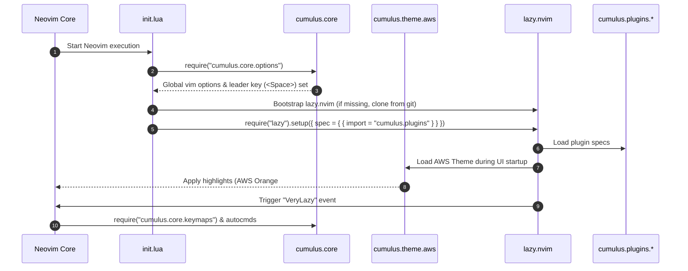

# System Architecture Specification: Cumulus Neovim Distribution

**Document Version:** 1.0.0  
**Status:** Approved for Implementation  
**Author:** Winston (System Architect)  
**PRD Reference:** [`prd-cumulus-nvim.md`](file://./_bmad-output/planning-artifacts/prd-cumulus-nvim.md)  

---

## 1. System Overview & Architectural Invariants

**Cumulus** is designed as a standalone, modular Neovim distribution optimized for Cloud, SRE, and DevOps workloads. 

### Core Architectural Invariants:
1. **Zero Upstream Distro Coupling:** No imports of `LazyVim/LazyVim` or reliance on `lazyvim.json`. Plugin management is handled directly via `lazy.nvim`.
2. **Unified `cumulus.*` Namespace:** All configuration, plugin specifications, custom utilities, and theme engines are encapsulated within the `lua/cumulus/` directory tree.
3. **IaC First-Class System Integration:** Out-of-the-box configuration for Terraform (HCL), AWS CloudFormation / SAM, Ansible, Docker, and Kubernetes/Helm without manual plugin assembly.
4. **Centralized AWS Theme Engine:** Single source of truth for color palettes (`lua/cumulus/theme/aws.lua`) exposing programmatic highlight groups for core Vim syntax, float windows, and plugin integrations.

---

## 2. Target File & Namespace Hierarchy

```
.
├── init.lua                        # Entry point: loads options, bootstraps lazy.nvim, loads specs
├── stylua.toml                     # Code formatting rules (2 spaces, 120 width)
├── scripts/
│   ├── install.sh                  # Standalone system dependency & Neovim bootstrap script
│   └── validate.sh                 # Headless verification script (Lazy check + Mason check)
└── lua/
    └── cumulus/
        ├── init.lua                # Main setup module
        ├── core/
        │   ├── options.lua         # Vim options (numbers, HRM timeouts, mouse, leader)
        │   ├── keymaps.lua         # Global & cloud navigation keymaps (no LazyVim helpers)
        │   └── autocmds.lua        # FileType triggers, auto-save rules, IaC helpers
        ├── theme/
        │   ├── init.lua            # Colorscheme entry point (vim.cmd.colorscheme)
        │   └── aws.lua             # AWS Palette definition & highlight group generator
        ├── plugins/
        │   ├── core-treesitter.lua # Treesitter parsers (HCL, YAML, Dockerfile, Terraform, Bash)
        │   ├── core-mason.lua      # Mason installer configuration & tool pinning
        │   ├── core-lsp.lua        # nvim-lspconfig setups (terraformls, yamlls, ansiblels, etc.)
        │   ├── core-cmp.lua        # Autocompletion engine setup (nvim-cmp or blink.cmp)
        │   ├── cloud-terraform.lua # Terraform & OpenTofu specific integration & keymaps
        │   ├── cloud-aws.lua       # CloudFormation / SAM / cfn-lint integration
        │   ├── cloud-ansible.lua   # Ansible playbooks & ansible-lint setup
        │   ├── cloud-k8s.lua       # Helm & Kubernetes manifest specs
        │   ├── tools-formatting.lua# conform.nvim (terraform fmt, yamlfmt, shfmt)
        │   ├── tools-linting.lua   # nvim-lint (tflint, cfn-lint, ansible-lint)
        │   ├── ui-dashboard.lua    # Cumulus branded dashboard (snacks.nvim / alpha)
        │   ├── ui-statusline.lua   # Lualine configured with AWS theme palette
        │   ├── ui-bufferline.lua   # Tabline / Bufferline configured with AWS accent
        │   └── ui-noice.lua        # Cmdline & UI notification popups
        └── util/
            ├── iac.lua             # IaC tool discovery & split terminal runners
            ├── maven.lua           # Preserved JVM build tool integration
            └── gradle.lua          # Preserved JVM build tool integration
```

---

## 3. Component Architecture & Lifecycle

### Bootstrapping Lifecycle Sequence



---

## 4. IaC & Cloud Tooling Technical Specifications

### LSP & Tooling Matrix

| Domain | Language Server (`lspconfig`) | Linter (`nvim-lint`) | Formatter (`conform.nvim`) | Treesitter Parsers |
| :--- | :--- | :--- | :--- | :--- |
| **Terraform / OpenTofu** | `terraformls` | `tflint` | `terraform_fmt` | `hcl`, `terraform` |
| **AWS CloudFormation** | `yamlls` (with CFN schemas) | `cfn_lint` | `yamlfix` / `prettier` | `yaml`, `json` |
| **Ansible** | `ansiblels` | `ansible_lint` | `yamlfix` | `yaml` |
| **Kubernetes / Helm** | `helm_ls`, `yamlls` | `kube-linter` | `yamlfix` | `helm`, `yaml` |
| **Docker** | `dockerls` | `hadolint` | `shfmt` | `dockerfile` |
| **Shell / Automation** | `bashls` | `shellcheck` | `shfmt` | `bash` |

---

## 5. AWS Theme Specification

### Palette Definitions (`lua/cumulus/theme/aws.lua`)

```lua
local palette = {
  -- Core AWS Brand Colors
  aws_orange     = "#FF9900",
  aws_orange_dim = "#CC7A00",
  navy           = "#071521",
  navy_light     = "#0E1F2D",
  navy_lighter   = "#152D42",

  -- Backgrounds
  bg             = "#05101C",
  bg_sidebar     = "#040D17",
  bg_statusline  = "#020A12",
  bg_visual      = "#152D42",
  bg_selection   = "#16324C",

  -- Float Window Precision
  float_bg       = "NONE",
  border_fg      = "#FF9900",

  -- Foreground & Syntax
  fg             = "#F5F7FA",
  fg_dim         = "#C8D0D8",
  fg_gutter      = "#243848",
  blue           = "#5A93B8",
  blue_light     = "#6DA8C9",
  cyan           = "#5D969D",
  green          = "#6FB865",
  green_soft     = "#7CC674",
  red            = "#E65C5C",
  orange_soft    = "#FFB347",
}
```

### Critical Highlight Invariants:
* `FloatBorder`: `{ fg = palette.aws_orange, bg = "NONE" }`
* `NormalFloat`: `{ fg = palette.fg, bg = palette.navy_light }`
* `StatusLine`: `{ fg = palette.fg, bg = palette.bg_statusline }`
* `CursorLineNr`: `{ fg = palette.aws_orange, bold = true }`

---

## 6. Migration Plan & Step-by-Step Implementation

1. **Namespace Refactoring:** Create `lua/cumulus/` directory structure and migrate existing custom utilities (`maven.lua`, `gradle.lua`) to `lua/cumulus/util/`.
2. **Core Options & Keymaps Decoupling:** Re-implement default options and keymaps in `lua/cumulus/core/options.lua` and `keymaps.lua` to remove reliance on LazyVim defaults.
3. **AWS Theme Engine:** Build `lua/cumulus/theme/aws.lua` and `lua/cumulus/theme/init.lua` for standalone colorscheme loading.
4. **Plugin Spec Porting:** Convert `lua/plugins/*.lua` specs into `lua/cumulus/plugins/` specs. Introduce `cloud-*.lua` specs for IaC tools.
5. **Entry Point Update:** Overwrite `init.lua` and `lua/config/lazy.lua` to point to `cumulus.plugins`. Remove `lazyvim.json`.
6. **Validation:** Execute `nvim --headless "+Lazy check" +qa` to confirm 100% clean initialization.

---

## 7. Trade-offs & Alternatives Considered

* **Alternative 1: Keep LazyVim as base layer and override everything.**
  * *Verdict:* Rejected. Overriding LazyVim requires constant updates to match upstream breaking changes in `lazyvim.plugins`, violating the stability invariant required for SRE/DevOps environments.
* **Alternative 2: Single monolithic `init.lua` file.**
  * *Verdict:* Rejected. Modular plugin specs under `lua/cumulus/plugins/` allow isolated maintenance of Terraform, AWS, and Ansible specs without risking core editor startup.
